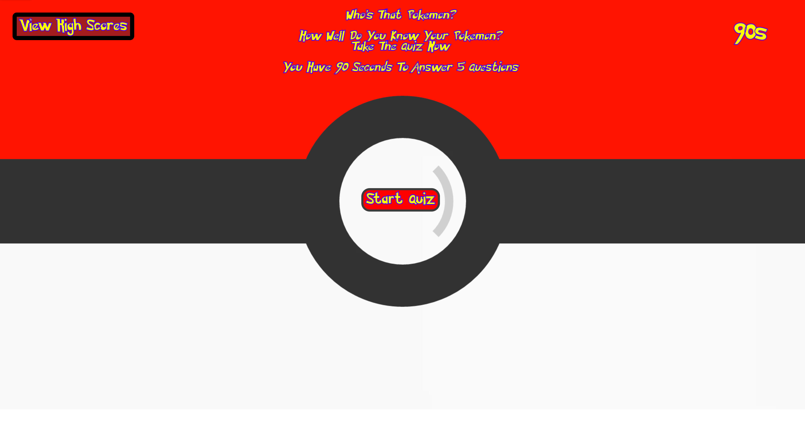

# Pokemon-Quiz

## Usage
If your a pokemon fan then this is the right app for you. This app is a fun and interactive quiz to test your skills if you know your pokemon well. User will be given a series of 5 questions that need to answered in a timely manner. Ready to test your skills? Take the quiz now!

## Description
This app is contains series of 5 question that will test out pokemon fans out there if they know their pokemon well. It includes a reset quiz button so user can reset the game anytime and not record any scores. Just to be more fun, i added a different type of pokemon sound in each click, when the game is over, and a battle sound while the user is taking the quiz. User will be able to save their score towards the end, as well as when the timer runs out. I taken the accountability to give a warning in the beginning about high volume. This app have different type of CSS styling depending if access through desktop or phone. 

## URL
https://jayp308.github.io/poke-quiz/

## Screenshots

Desktop View

Phone View

## Credits

Junnel R. Padilla, Stackoverflow, mkgifs.com, wallpaperaccess.com, deviantart.com, myinstants.com, chatGPT,

## License

MIT License

Copyright (c) 2023 JP Padilla

Permission is hereby granted, free of charge, to any person obtaining a copy
of this software and associated documentation files (the "Software"), to deal
in the Software without restriction, including without limitation the rights
to use, copy, modify, merge, publish, distribute, sublicense, and/or sell
copies of the Software, and to permit persons to whom the Software is
furnished to do so, subject to the following conditions:

The above copyright notice and this permission notice shall be included in all
copies or substantial portions of the Software.

THE SOFTWARE IS PROVIDED "AS IS", WITHOUT WARRANTY OF ANY KIND, EXPRESS OR
IMPLIED, INCLUDING BUT NOT LIMITED TO THE WARRANTIES OF MERCHANTABILITY,
FITNESS FOR A PARTICULAR PURPOSE AND NONINFRINGEMENT. IN NO EVENT SHALL THE
AUTHORS OR COPYRIGHT HOLDERS BE LIABLE FOR ANY CLAIM, DAMAGES OR OTHER
LIABILITY, WHETHER IN AN ACTION OF CONTRACT, TORT OR OTHERWISE, ARISING FROM,
OUT OF OR IN CONNECTION WITH THE SOFTWARE OR THE USE OR OTHER DEALINGS IN THE
SOFTWARE.

